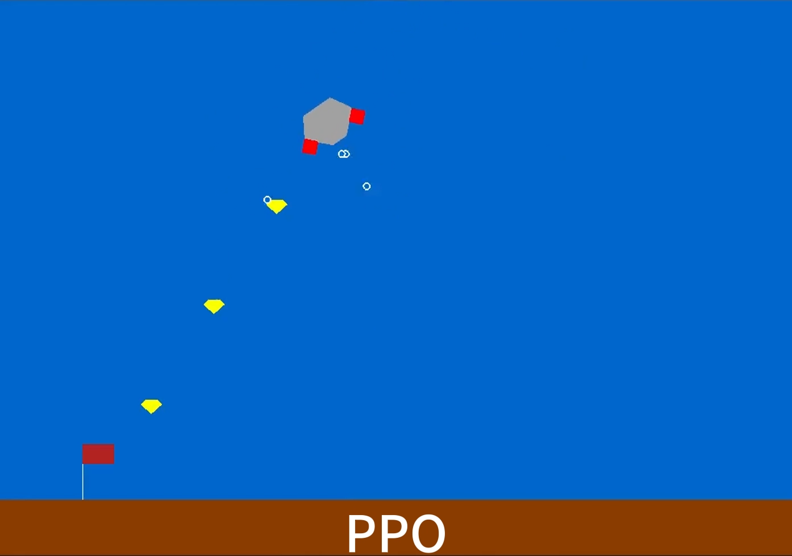

# Underwater Robot

This is a custom RL environment addressing on a underwater exploration robot. In the task, the robot agent is dropped from the surface of water 
and required to reach the goal on the bottom bed in by the influence of gravity and floating. To control its pose the robot is equipped with three
engines, the main of which is at the bottom of robot and the other two are mounted in diagnal sides. Along the way there are sub-goals (shown as 
yellow diamonds)and the robot is encouraged to reach these waypoints to get small rewards, also a reward is given each time it reach closer to the 
final goal but a negative rewardas penalty if it crashes with the bed by extreme linear velocity. Besides, there is a flow force from the water with 
random direction (shown as the red arrow)for each run to make the task more challenge, the robot is trained to overcome these difficulties and safely 
arrive the destination.



## Setup
To install dependencies of this environment, run the command
```
pip install -r requirements.txt
```

## The file structure
```
./uw_robot:
    /env
        /custom1.py
        /__init__.py
    /__init__.py

./DQN            # where the trained DQN model is saved
    /DQN.png
    /dqn_test.pth

./PPO            # where the trained PPO model is saved
    /PPO.png
    /PPO_CustomEnv-v0_0_0.pth
    /PPO_CustomEnv-v0_log_0.csv

./DQN_brain.py   # implementation of DQN
./DQN_train.py
./DQN_test.py
./PPO_brain.py   # implementation of PPO
./PPO_train.py
./PPO_test.py
./Keyboard.py
```

## Running
### 1.manuall control
Run the command to control the robot by keyboard with up, left and right.
```
python Keyboard.py
```
### 2.Deep Q Network(DQN)
Run the command to start training by DQN
```
python DQN_train.py
```
Run the command to test a trained DQN model
```
python DQN_test.py
```
### 3.Proximal Policy Optimization (PPO)
Run the command to start training by PPO
```
python PPO_train.py
```
Run the command to test a trained PPO model
```
python PPO_test.py
```

